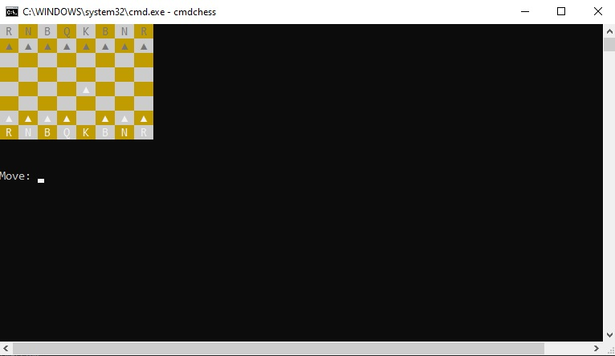

cmdchess
========
Play chess on your command line.

Overview
--------
This project is still in progress and is expected to be completed in a few days.

Errors
~~~~~~
* Blocked moves exceptions left uncatched
* Check and checkmate
* Promotion

Source location
~~~~~~~~~~~~~~~
Hosted on GitHub: https://github.com/leonarduschen/cmdchess

Installation
~~~~~~~~~~~~
Clone the project and in the folder run:
``pip install .``

Quick Start
-----------
Launch app:
``cmdchess``

Help:
``cmdchess --help``

Future
------
This package is open sourced under the MIT license.

Upcoming featues

* Popular chess variants (e.g. chess960, horde)
* Puzzles